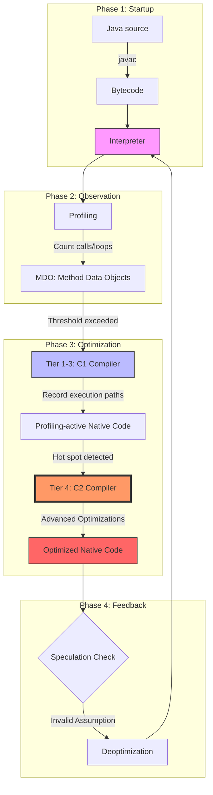
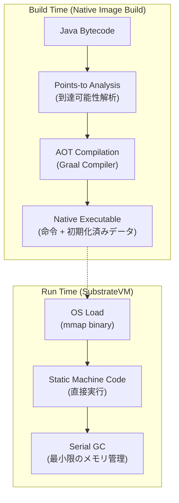
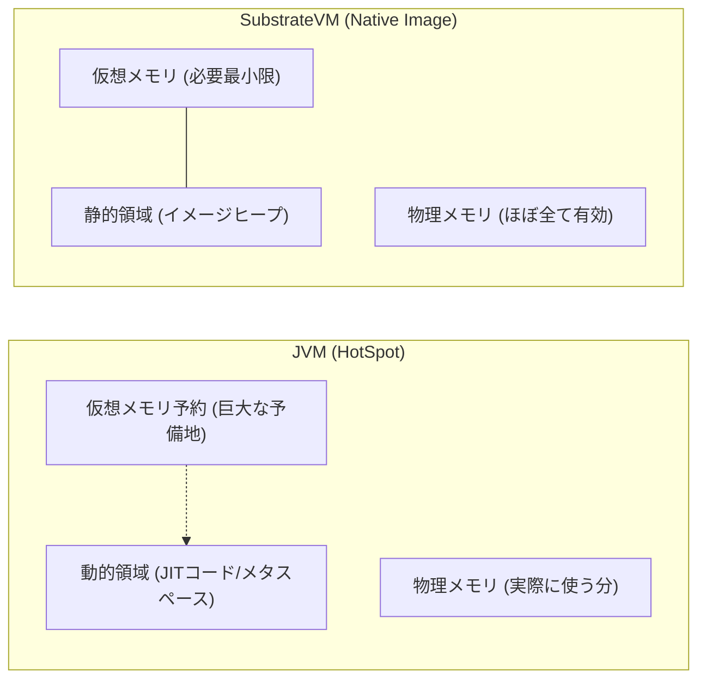

## 1. イントロダクション

お仕事でQuarkusというWebフレームワークを用いた開発をした際、ネイティブイメージへの事前コンパイルの威力に驚きました。
ネイティブイメージへのコンパイルでは、従来のjarファイルのようなJVMで動くファイルにするのではなく、LinuxのELFファイルなどの実行ファイルに直接アプリケーションを丸っとコンパイルできます。実行ファイルはJVMを必要とせず、バイナリファイルサイズも非常に小さいです。
また、事前にコンパイルされるのでJavaアプリでよくある暖気処理を経ずとも、爆速起動ができ、実行時のメモリ使用量も非常に小さいです。

そこで、今回、簡単ないくつかのJavaスクリプトとLinuxコマンドを用いて、GraalVM(Quarkusのアップストリーム)の仕組みを覗いてみました。

## 省メモリ性とシステムコール数の少なさの検証

最初のセクションでは、同一のJavaソースコードを用い、標準的なJVM（HotSpot）とNative Image（SubstrateVM）がOSのリソースを奪い合う現場を実測データで可視化してみます。

### 検証環境の準備

検証の透明性を確保するため、環境はNixで再現可能な形で定義しました。ビルドに必要なツールチェーンと、計測用の`strace`、`pmap`を同一環境に揃えています。

::: details flake.nix
```nix
{
  description = "GraalVM Deep Dive environment";

  inputs = {
    nixpkgs.url = "github:NixOS/nixpkgs/nixos-unstable";
  };

  outputs = { self, nixpkgs }:
    let
      system = "x86_64-linux"; # macOSの場合は "aarch64-darwin" 等に変更
      pkgs = import nixpkgs {
        inherit system;
        config.allowUnfree = true;
      };
    in
    {
      devShells.${system}.default = pkgs.mkShell {
        buildInputs = with pkgs; [
          graalvmPackages.graalvm-ce
          gcc
          glibc
          zlib
          binutils
          strace
          utillinux
          linuxPackages_latest.perf
        ];
      };
    };
}
```
:::

#### 検証用ソースコード

検証を簡単にするため、標準ライブラリのみで実装した最小限のHTTPサーバーを用意してみます。

`MiniServer.java`

```java
import java.io.*;
import java.net.*;

public class MiniServer {
    public static void main(String[] args) throws IOException {
        ServerSocket server = new ServerSocket(8080);
        System.out.println("Server started on port 8080");
        while (true) {
            try (Socket socket = server.accept();
                 PrintWriter out = new PrintWriter(socket.getOutputStream(), true)) {
                out.println("HTTP/1.1 200 OK\r\nContent-Length: 12\r\n\r\nHello World!");
            }
        }
    }
}

```

### 実証実験：システムコールの計測

まずは`strace`コマンドを用いて、アプリケーションがOSに対して発行するシステムコールの総量を比較してみます。
これにより、JVMランタイムがいかに動的かという部分と、ネイティブイメージがいかに「静的」かという部分を検証してみます。

#### 実行コマンド

```bash
# JVM版の計測（起動からReady状態までをカウント）
$ strace -c -f java MiniServer

# Native Image版のビルドと計測
$ native-image MiniServer
$ strace -c ./miniserver

```

#### 実行結果

JVM (HotSpot):

```text
% time     seconds  usecs/call     calls    errors syscall
------ ----------- ----------- --------- --------- ------------------
...
 94.11    3.718690        1692      2197       446 futex
...
  1.22    0.048278         137       350           mmap
...
  1.08    0.042651         121       351           mprotect
------ ----------- ----------- --------- --------- ------------------
100.00    3.951298                   4218       637 total
```

Native Image (SubstrateVM):

```text
% time     seconds  usecs/call     calls    errors syscall
------ ----------- ----------- --------- --------- ------------------
...
100.00    0.013697          60       227        19 total
```

JVM版は起動完了までに数千回のシステムコールを乱発しますが、ネイティブイメージ版は極めて少ないです。

具体的には合計システムコール数はJVMでの実行で4218回、対してネイティブイメージでは227回でした。
つまりネイティブイメージはJVMの約1/20の手間で起動できていることが分かります。
特に、スレッド同期を司る`futex`や、メモリ権限を操作する`mprotect`の差が顕著です。

### 実証実験：メモリフットプリントの解剖

次に、`pmap`コマンドを用いて、プロセスのメモリマップを詳細に調べ、物理メモリ（RSS）と仮想メモリ（VIRT）の使用状況を確認してみます。

#### 実行コマンド

```bash
# アプリ起動後、別ターミナルでPIDを指定して実行
$ pmap -XX <PID> | tail -n 1

```

#### 実測値比較表

| 指標 (KB) | JVM (HotSpot) | Native Image (SVM) | JVMと比較しての削減率 |
| --- | --- | --- | --- |
| VIRT (仮想メモリ予約) | 40,921,320 | 234,020 | **99.4% 削減** |
| RSS (物理メモリ占有) | 76,424 | 4,612 | **94.0% 削減** |

注目すべきは仮想メモリの予約量です。JVMは約40GBもの広大なアドレス空間を将来の拡張のために予約していますが、ネイティブイメージはわずか234MBで済んでいます。
これは、後述する「閉鎖世界仮説」に基づき、実行に必要なメモリ量がビルド時に確定していることを示唆しています。

## 2. そもそものJVMの仕組み

セクション1で確認したJVMの大量のシステムコール（特に`futex`や`mprotect`）は、どのような理由で発行されているのかを見てみたいと思います。
これらは、Javaが誇る「階層型コンパイル」という非常に高度かつアグレッシブな最適化プロセスの産物です。

### 階層型コンパイルの構造図

JVM内部でのコンパイルフェーズの遷移と、命令が書き換えられていく流れは下記になります。



### 補助実験：JITコンパイルの振る舞いを可視化する

JVMが実行中に「何に悩み、いつコードを書き換えているのか」を観察するために、以下の実験用スクリプトを実行してみます。

#### 補助実験用コード

意図的に高頻度のループを発生させ、JITコンパイラ（C1/C2）を誘発させるコードです。

`JITDemo.java`
```java
public class JITDemo {
    public static void main(String[] args) {
        System.out.println("Beginning execution loop...");

        for (int i = 0; i < 20000; i++) {
            calculate();
        }

        System.out.println("Execution finished.");
    }

    private static void calculate() {
        // CPUに負荷をかけ、インライン化などの最適化の余地を作る
        double val = Math.sqrt(Math.random());
    }
}

```

#### 実験コマンド

JVMの内部活動をリアルタイムで追跡するために、フラグ `-XX:+PrintCompilation` を使用します。

```bash
# バイトコードへのコンパイル
$ javac JITDemo.java

# JITコンパイルログを有効にして実行
$ java -XX:+PrintCompilation JITDemo

```

#### 実行結果

```text
...
 23    1       3       java.lang.Byte::toUnsignedInt (6 bytes)
...
 45   33       4       java.lang.String::hashCode (60 bytes)
...
 50    2       3       java.lang.String::hashCode (60 bytes) made not entrant
...
 85  207       3       JITDemo::calculate (8 bytes)
...
 86  212       4       JITDemo::calculate (8 bytes)
...
```

### 実測ログの精密分析

ログに出力された上記の断片は、JVMが走りながら形を変えている様子が見えます。

3つのフィールドの「3」や「4」という数値は、最適化の階層（Tier）を示しています。

* Tier 3 (C1 Compiler): 頻繁に呼ばれるメソッドに対し、プロファイリング（計測用）命令を埋め込んだネイティブコードを生成
* Tier 4 (C2 Compiler): Tier 3で得られた統計データを元に、インライン化やデッドコード削除などを施した「極限の最適化コード」を生成
* made not entrant: より優れたTier 4コードが完成したため、古いTier 3コードを「無効化」する準備に入った合図

### なぜリソース消費が激しいのか？

この動的な最適化戦略は、OSレイヤーで以下のコストとして跳ね返ります。

1. `mprotect` と `mmap` の連発:
JITコンパイラがメモリ上に新しいマシンコードを書き込むたびに、その領域を「書き込み可能」から「実行可能」へと権限変更（`mprotect`）する必要があります。
2. `futex` によるスレッド同期:
JVMではメインのスレッドが処理を進めている横で、バックグラウンドのコンパイラスレッドが並行して作業を行います。完成した瞬間に安全にコードを差し替えるため、膨大なスレッド間同期が発生します。
3. 40GBもの仮想メモリ予約:
「いつ、どれだけ巨大な最適化コードが生成されるか」が事前には予測できないため、JVMはあらかじめ広大なアドレス空間を予約しておく必要があります。

JVMは、「実行してみるまで最適なコードはわからない」という前提で、動的に最適化を行います。実際のデータに基づいた投機的最適化が可能にするピークパフォーマンスは驚異的ですが、その柔軟性を維持するために、起動直後のリソースを犠牲にしています。

## 3. SubstrateVMの静的解析とAOT

JVMが「実行しながらコードを書き換える」のに対し、GraalVMのネイティブイメージの核心であるSubstrateVMは、「実行が始まる前にすべての命令を確定させる」AOT（Ahead-of-Time）コンパイル方式を採用しています。

セクション1で確認した「システムコール 1/20」という驚異的な数値は、この「実行時にはもう何もしない」という設計思想の現れです。

### Closed-World Assumption

SubstrateVMが「速くて軽い」最大の理由は、ビルド時に適用される"Closed-World Assumption"にあります。ビルドプロセス（`native-image` コマンド実行時）では、以下のような過酷な選別が行われます。

1. 静的解析: `main`メソッドを出発点として、実行時に呼び出される可能性があるコードをすべて走査します。
2. デッドコードの物理削除: 走査に引っかからなかったコードは「この宇宙には存在しないもの」とみなされ、バイナリから完全に切り捨てられます。
3. バイナリへの固定: 解析されたコードはすべてターゲットCPUのマシンコードに変換され、実行ファイルの中に直接書き込まれます。

### AOTコンパイルの構造図

ビルド時に上記の重い作業をすべて終わらせてしまうため、実行時は完成した成果物を実行するだけの状態になります。



### なぜ爆速起動が実現できるのか

JVMと比較すると、SubstrateVMの実行時がいかにシンプルかが、計測データからも裏付けられます。

* `made not entrant`の消失: 命令が不変であるため、実行中にコードを差し替える概念自体が存在しません。
* `mprotect`の激減: 命令はバイナリの`.text`セクションに配置済みです。OSがバイナリをロードした瞬間に実行権限が確定するため、実行中に権限を書き換える必要がありません。
* `futex`の消失: プロファイラもコンパイラも、それを支えるバックグラウンドスレッドも存在しません。余計なスレッド間同期が発生しないため、スレッド管理コストがほぼゼロになります。

### 補足：SubstrateVMが「クローズドワールド」である代償

SubstrateVMは、JVMが持っていた「実行時の柔軟性（動的なクラスロードや再最適化）」をビルド時に捧げることで、「爆速の起動」と「極小のフットプリント」を実現していますが、アプリケーションのパフォーマンス的には投機的最適化が実行できる従来のJVMのほうが良いシチュエーションがあります。

## 4. メモリ構造の解剖

`pmap -XX`の実行結果で最も衝撃的だったのは、仮想メモリ（VIRT）の予約量でした。JVMの40GBに対し、ネイティブイメージはわずか234MBで、この差は、単なる効率の良し悪しではなく、メモリ空間に対する思想の根本的な違いから生まれています。

### ダイナミック・マネジメントを行うJVM (HotSpot)

JVMのメモリマップが数GB〜数十GBに膨らむのは、将来を見据えた広大なメモリの占有を実施するという戦略をとっているためです。

1. 巨大な仮想空間の予約: JVMは起動時、ヒープ領域（Javaオブジェクトが作られる場所）として巨大な連続したアドレス空間を確保します。これは、後でメモリが必要になった際に、バラバラな場所に確保して管理コスト（ポインタ計算の複雑化）が増大するのを防ぐためです。
2. メタスペースとコードキャッシュ: JITコンパイルが実行されるたびにキャッシュが増え、動的なクラスロードによって"Metaspace"と呼ばれる非ヒープなメモリ領域が拡張されます。いつ、どれだけのコードが生成されるか予測できないため、JVMはOSに対して常に広大な予備の領域を要求します。

### イミュータブル・ランタイムなSubstrateVM

対するネイティブイメージは、ビルド時点で実行に必要なメモリを計算済みです。

1. イメージヒープ (Image Heap): 最大の特徴は、ビルド時に生成されたJavaオブジェクトがバイナリの一部として含まれていることです。静的な定数やクラスのメタデータは、実行時に生成されるのではなく、OSがバイナリをロードした瞬間にメモリ上に既にある状態となります。
2. 固定されたメモリマップ: 実行時に新しいコードやクラスは現れないため、Metaspaceのような拡張領域を必要としません。実行に必要な領域が最初から固定されているため、仮想メモリの予約を極限まで小さくできるのです。

### メモリ構造の視覚的比較


